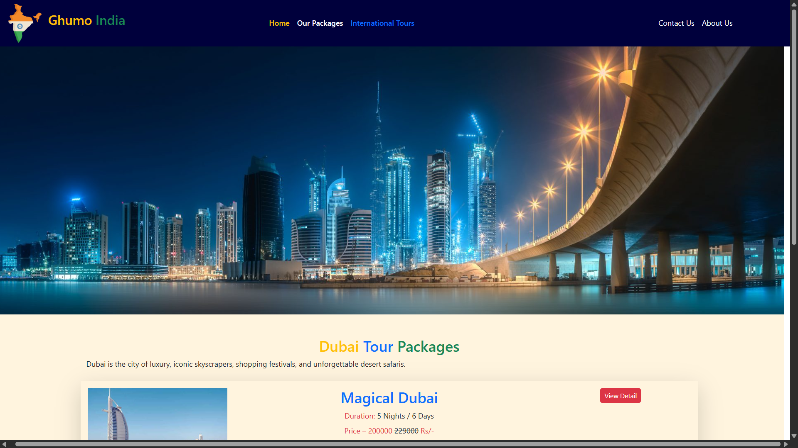
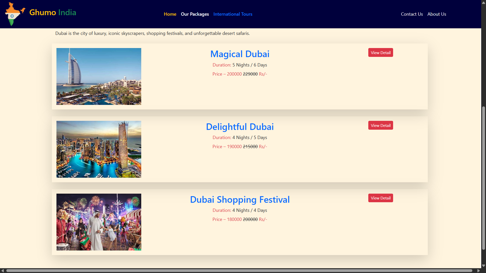
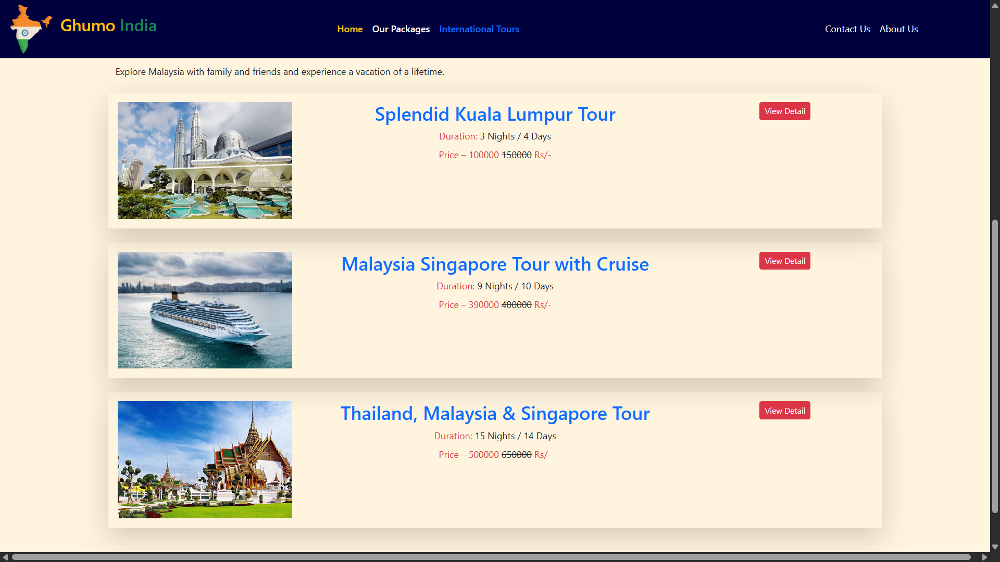
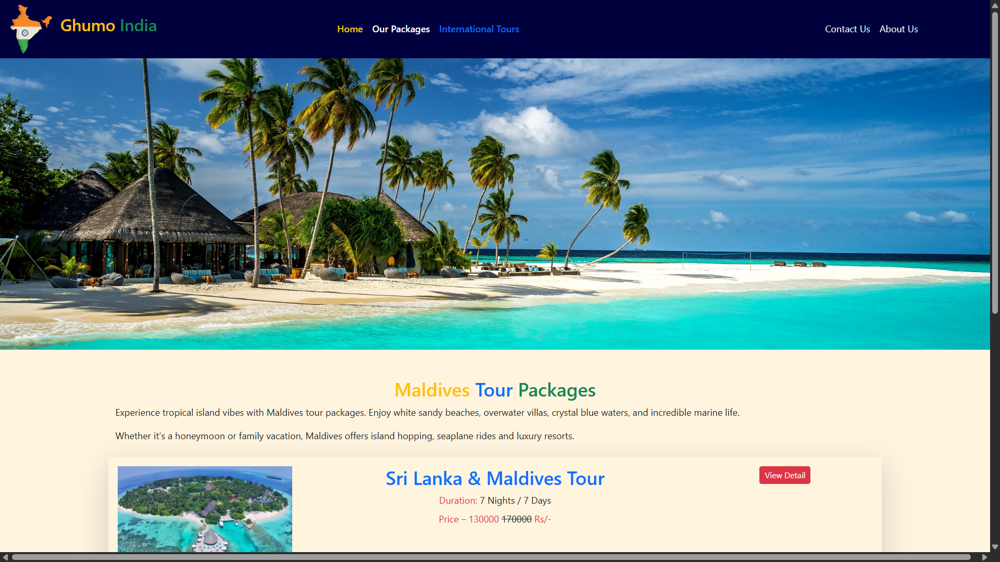
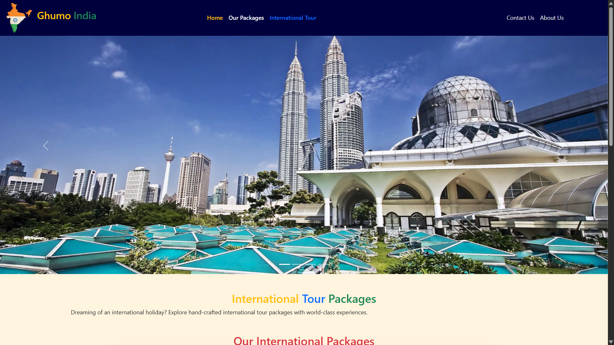

# 🌍 Travel Website

A static and responsive travel website built using **React**.  
This project showcases popular Indian and international travel destinations along with travel packages and images.

---

## 🚀 Technologies Used

- React
- JavaScript
- HTML
- CSS

---

## ✨ Features

- Modern and responsive UI
- Travel destination showcase
- Attractive travel packages
- Smooth navigation
- Static and fast-loading website

---

## 📸 Screenshots

  
  
  
  
  
  

---

## 🛠️ How to Run the Project

1. Clone the repository:

git clone https://github.com/ayanpathan-dev/ReactTravelWebsite.git

2. Install dependencies:

npm install

3. Start the project:

---

## 👨‍💻 Author

**Ayan Pathan**

---

